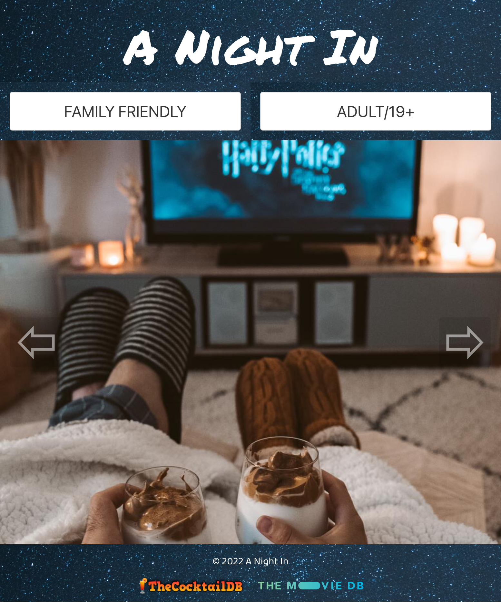

# A Night In
## Description
Rainy evening?  Car broke down?  This application has your home entertainment needs covered.

Suitable for both families and adults only, A Night In, invites users to find the perfect drink and movie pairing.

On the landing page, users are greeted with a slideshow of movie images.  Contained near the images are two buttons: one for families and another for adults/19+.  

Clicking on the family friendly button leads the user to a new page where they are presented with two dropdown buttons.  The “drink” button on left, when clicked, displays a list of drink types.  Clicking on one of those types (i.e. – Shakes), causes an image card and a recipe to be randomly generated and shown to the screen.  The “movie” button on the right functions similarly.  Once clicked, the user is presented with a list of genres (i.e. – Animation).  The clicked genre will produce several movie posters.  Users can then click on the poster that appeals to them the most.  At this point, a single image will display containing a description of the movie and its popularity rating.  Users can feel secure in knowing that the “movie” button is designed to return films only containing ratings of G and PG.

The adult/19+ access only portal functions in a similar manner, albeit with fewer restrictions.  Instead of drink types, the user is presented with a list of alcoholic ingredients (i.e. – whiskey).  As movie types are not subject to rating filters, users are invited to experience the full range of options (i.e. – R-rated films).

URL: https://raposamillar.github.io/A-Night-In/

## Technologies Used
Languages: HTML, CSS, and JavaScript 
CSS Framework: Bulma  
API Keys: The CocktailDB and The MovieDB 
Local Storage

## Collaborative Team
Nabeel Mansuri  
Tony Meng  
Jatin Na  
Lisa Raposa Millar  
Keeve Whyte

## Additional Information and Attributions
Please note that this is a non-commercial project.  As such, the collaborative team gratefully acknowledges The CocktailDB and The MovieDB for making their data openly accessible. 

 
  

 
 

